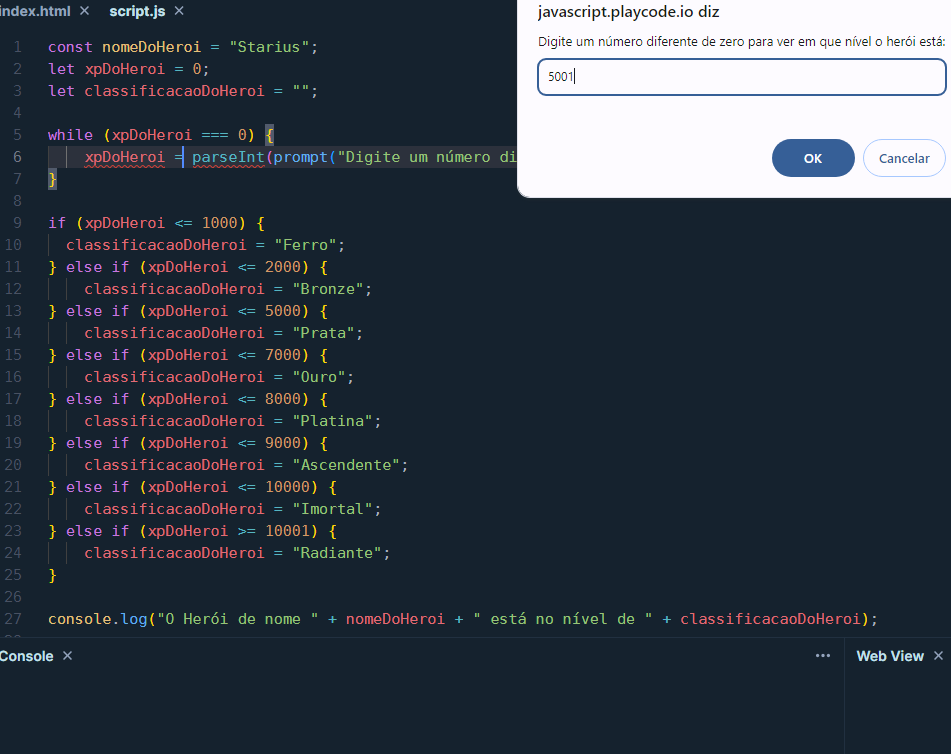
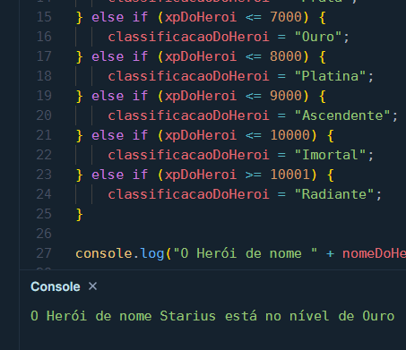

# **Classificador de nível de Herói**

## **Desafio**

> Módulo 4 - Dominando estruturas de controles - Classificador de Nível de Herói em 22/10/2024

## **Texto do Desafio**

> ### **Instruções para entrega**
> 
> ### 1️⃣ Desafio Classificador de nível de Herói
> 
> **O Que deve ser utilizado**
> 
> - Variáveis
> - Operadores
> - Laços de repetição
> - Estruturas de decisões
> 
> ### Objetivo
> 
> Crie uma variável para armazenar o nome e a quantidade de experiência (XP) de um herói, depois utilize uma estrutura de decisão para apresentar alguma das mensagens abaixo:
> 
> Se XP for menor do que 1.000 = Ferro
Se XP for entre 1.001 e 2.000 = Bronze
Se XP for entre 2.001 e 5.000 = Prata
Se XP for entre 5.001 e 7.000 = Ouro
Se XP for entre 7.001 e 8.000 = Platina
Se XP for entre 8.001 e 9.000 = Ascendente
Se XP for entre 9.001 e 10.000= Imortal
Se XP for maior ou igual a 10.001 = Radiante
> 
> ### Saída
> 
> Ao final deve se exibir uma mensagem:
"O Herói de nome **{nome}** está no nível de **{nivel}**"
> 
> Bons estudos 😉

## **Resolução do Desafio (explicação e prints)**

O código foi executado no [Play Code](https://playcode.io/new), você pode testar o código por lá, pois lá você não precisa instalar nada na sua máquina para executar os scripts (tente mudar o valor de xpDoHeroi por exemplo).

Veja o código abaixo ou o arquivo script.js

```javascript
const nomeDoHeroi = "Starius";
let xpDoHeroi = 0;
let classificacaoDoHeroi = "";

while (xpDoHeroi === 0) {
    xpDoHeroi = parseInt(prompt("Digite um número diferente de zero para ver em que nível o herói está:"));
}

if (xpDoHeroi <= 1000) {
	classificacaoDoHeroi = "Ferro";
} else if (xpDoHeroi <= 2000) {
    classificacaoDoHeroi = "Bronze";
} else if (xpDoHeroi <= 5000) {
    classificacaoDoHeroi = "Prata";
} else if (xpDoHeroi <= 7000) {
    classificacaoDoHeroi = "Ouro";
} else if (xpDoHeroi <= 8000) {
    classificacaoDoHeroi = "Platina";
} else if (xpDoHeroi <= 9000) {
    classificacaoDoHeroi = "Ascendente";
} else if (xpDoHeroi <= 10000) {
    classificacaoDoHeroi = "Imortal";
} else if (xpDoHeroi >= 10001) {
    classificacaoDoHeroi = "Radiante";
}

console.log("O Herói de nome " + nomeDoHeroi + " está no nível de " + classificacaoDoHeroi);
```

veja os prints do resultado abaixo.

**Print 1**

<div align="center">
    
</div>

**Print 2**

<div align="center">
    
</div>

## **Ferramentas Usadas:**

[Play Code - Web](https://playcode.io/new)
