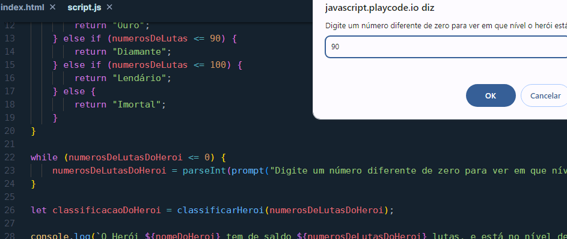
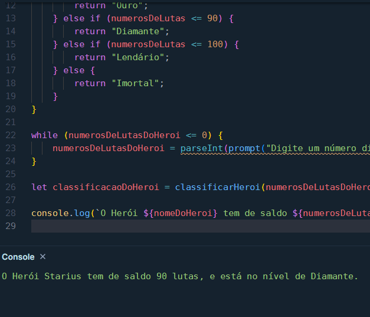

# **Calculadora de Partidas Rankeadas**

## **Desafio**

> Módulo 5 - Trabalhando com Funções - Calculadora de Partidas Rankeadas em 23/10/2024

## **Texto do Desafio:**

> ### Instruções para entrega
> ### 2️⃣ Calculadora de partidas Rankeadas
> 
> **O Que deve ser utilizado**
> 
> - Variáveis
> - Operadores
> - Laços de repetição
> - Estruturas de decisões
> - Funções
> 
> ### Objetivo:
> 
> Crie uma função que recebe como parâmetro a quantidade de vitórias e derrotas de um jogador,
depois disso retorne o resultado para uma variável, o saldo de Rankeadas deve ser feito através do calculo (vitórias - derrotas)
> 
> Se vitórias for menor do que 10 = Ferro
Se vitórias for entre 11 e 20 = Bronze
Se vitórias for entre 21 e 50 = Prata
Se vitórias for entre 51 e 80 = Ouro
Se vitórias for entre 81 e 90 = Diamante
Se vitórias for entre 91 e 100= Lendário
Se vitórias for maior ou igual a 101 = Imortal
> 
> ### Saída
> 
> Ao final deve se exibir uma mensagem:
"O Herói tem de saldo de **{saldoVitorias}** está no nível de **{nivel}**"
> 
> Bons estudos 😉

## **Resolução do Desafio (explicação e prints):**

O código foi executado no [Play Code](https://playcode.io/new), você pode testar o código por lá, pois lá você não precisa instalar nada na sua máquina para executar os scripts (tente mudar o valor de numerosDeLutasDoHeroi por exemplo).

Veja o código abaixo ou o arquivo script.js

```javascript
const nomeDoHeroi = "Starius";
let numerosDeLutasDoHeroi = 0;

function classificarHeroi(numerosDeLutas) {
    if (numerosDeLutas <= 10) {
        return "Ferro";
    } else if (numerosDeLutas <= 20) {
        return "Bronze";
    } else if (numerosDeLutas <= 50) {
        return "Prata";
    } else if (numerosDeLutas <= 80) {
        return "Ouro";
    } else if (numerosDeLutas <= 90) {
        return "Diamante";
    } else if (numerosDeLutas <= 100) {
        return "Lendário";
    } else {
        return "Imortal";
    }
}

while (numerosDeLutasDoHeroi <= 0) {
    numerosDeLutasDoHeroi = parseInt(prompt("Digite um número diferente de zero para ver em que nível o herói está:"));
}

let classificacaoDoHeroi = classificarHeroi(numerosDeLutasDoHeroi);

console.log(`O Herói ${nomeDoHeroi} tem de saldo ${numerosDeLutasDoHeroi} lutas, e está no nível de ${classificacaoDoHeroi}.`)
```

veja os prints do resultado abaixo.

**Print 1**

<div align="center">
    
</div>

**Print 2**

<div align="center">
    
</div>

## **Ferramentas Usadas:**

[Play Code - Web](https://playcode.io/new)
