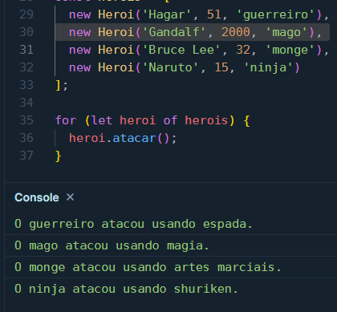

# **Escrevendo as Classes de Um Jogo**

## **Desafio**

> Módulo 6 - Eestruturas de Dados e Objetos - Escrevendo as Classes de Um Jogo em 25/10/2024

## **Texto do Desafio:**
 
> ### Instruções para entrega
> 
> ### 3️⃣ Escrevendo as classes de um Jogo
> 
> **O Que deve ser utilizado**
> 
> - Variáveis
> - Operadores
> - Laços de repetição
> - Estruturas de decisões
> - Funções
> - Classes e Objetos
> 
> ### Objetivo:
> 
> Crie uma classe generica que represente um herói de uma aventura e que possua as seguintes propriedades:
> 
> - nome
> - idade
> - tipo (ex: guerreiro, mago, monge, ninja )
> 
> além disso, deve ter um método chamado atacar que deve atender os seguientes requisitos:
> 
> - exibir a mensagem: "o {tipo} atacou usando {ataque}")
> - aonde o {tipo} deve ser concatenando o tipo que está na propriedade da classe
> - e no {ataque} deve seguir uma descrição diferente conforme o tipo, seguindo a tabela abaixo:
> 
> se mago -> no ataque exibir (usou magia)
> 
> se guerreiro -> no ataque exibir (usou espada)
> 
> se monge -> no ataque exibir (usou artes marciais)
> 
> se ninja -> no ataque exibir (usou shuriken)
> 
> ### Saída
> 
> Ao final deve se exibir uma mensagem:
> 
> - "o {tipo} atacou usando {ataque}" ex: mago atacou usando magia, guerreiro atacou usando espada.
> 
> Bons estudos 😉

## **Resolução do Desafio (explicação e prints):**

O código foi executado no [Play Code](https://playcode.io/new), você pode testar o código por lá, pois lá você não precisa instalar nada na sua máquina para executar os scripts.

Veja o código abaixo ou o arquivo script.js

```javascript
class Heroi {
  constructor(nome, idade, tipo) {
    this.nome = nome;
    this.idade = idade;
    this.tipo = tipo;
  }

  atacar() {
    let ataque;
    switch (this.tipo) {
      case 'mago':
        ataque = 'magia';
        break;
      case 'guerreiro':
        ataque = 'espada';
        break;
      case 'monge':
        ataque = 'artes marciais';
        break;
      case 'ninja':
        ataque = 'shuriken';
        break;
    }
    console.log(`O ${this.tipo} atacou usando ${ataque}.`);
  }
}

const herois = [
  new Heroi('Hagar', 51, 'guerreiro'),
  new Heroi('Gandalf', 2000, 'mago'),
  new Heroi('Bruce Lee', 32, 'monge'),
  new Heroi('Naruto', 15, 'ninja')
];

for (let heroi of herois) {
  heroi.atacar();
}
```

veja os prints do resultado abaixo

**Print 1**

<div align="center">
    
</div>

## **Ferramentas Usadas:**

[Play Code - Web](https://playcode.io/new)